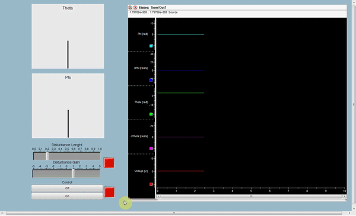

# Furuta Hardware in the loop

###### Please check the following repositories of more information on this project.
###### Simulation and controller design : [Furuta-Simulation](https://github.com/feippolito/Furuta-Simulation)
###### Control implementation on real pendulum : [Furuta-Control](https://github.com/feippolito/Furuta-Control)
###### Co-simulation - controller optimisation : [Furuta-Cosimulation](https://github.com/feippolito/Furuta-Cosimulation)
